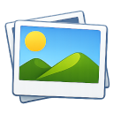
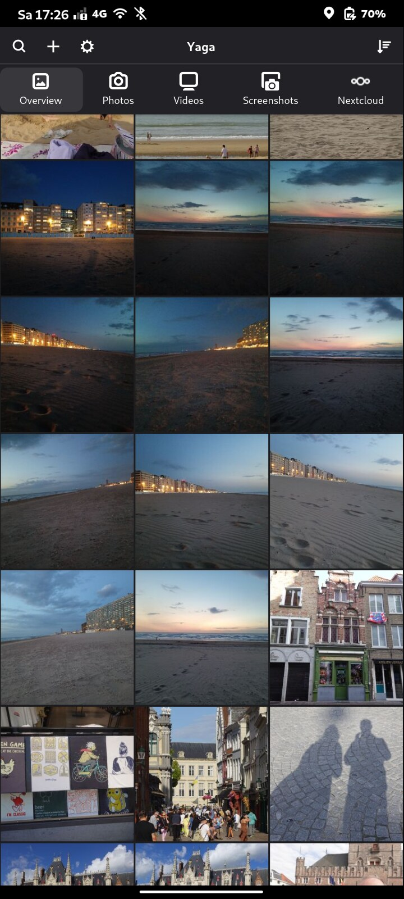
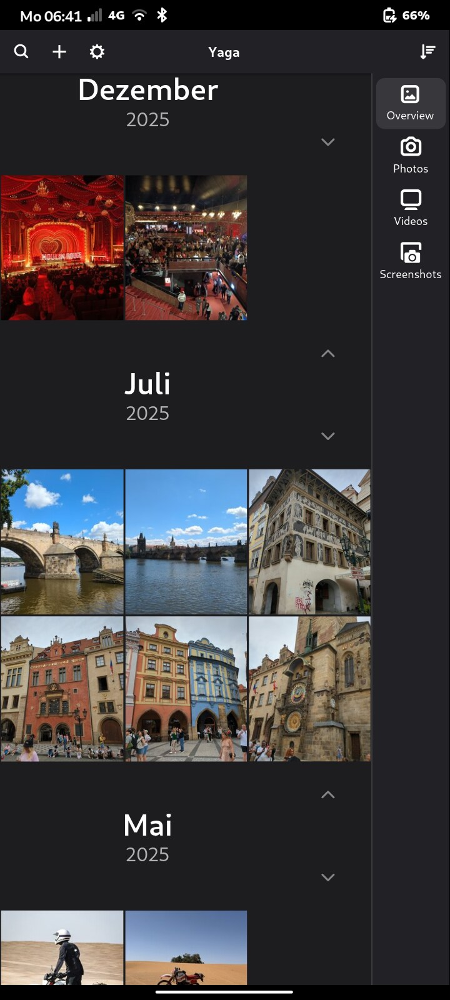
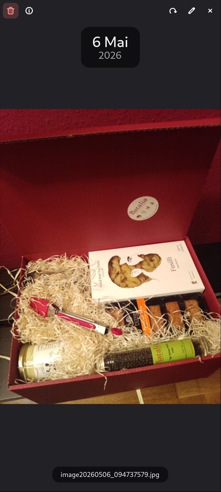
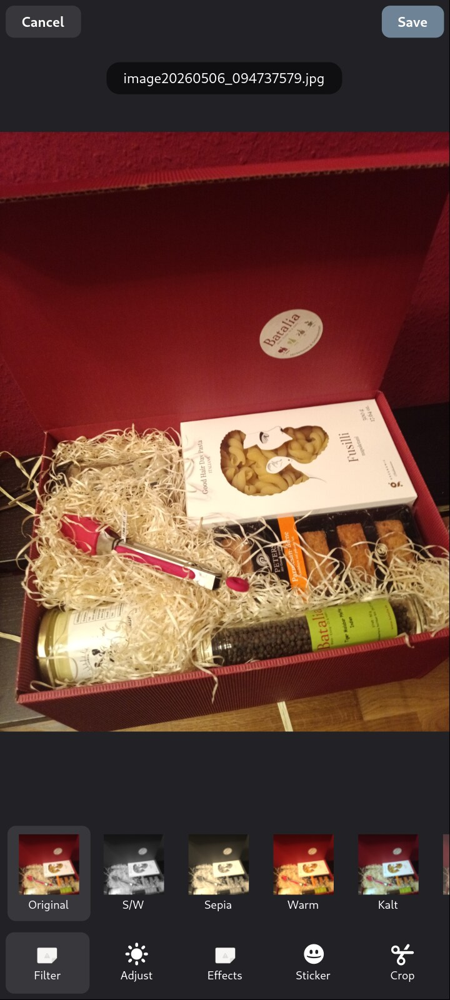
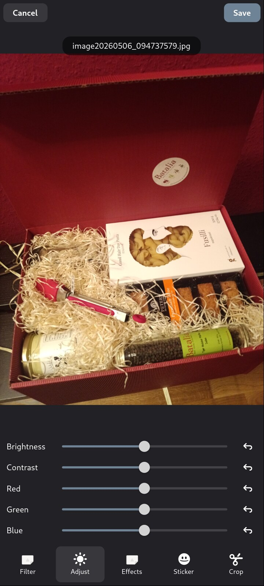
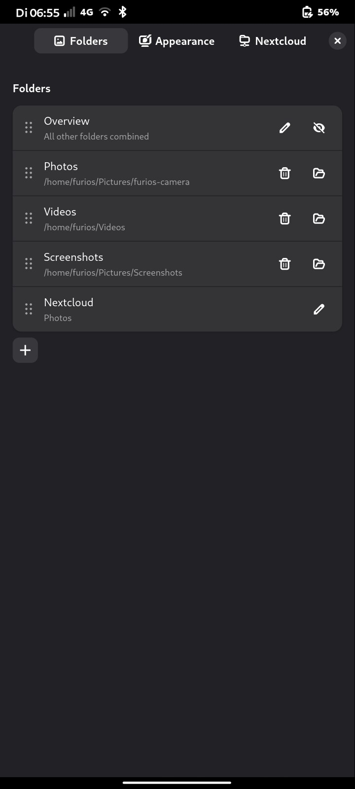
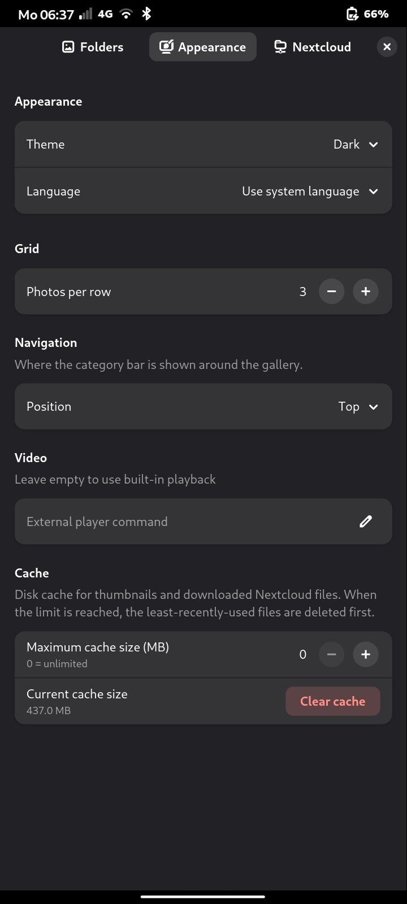
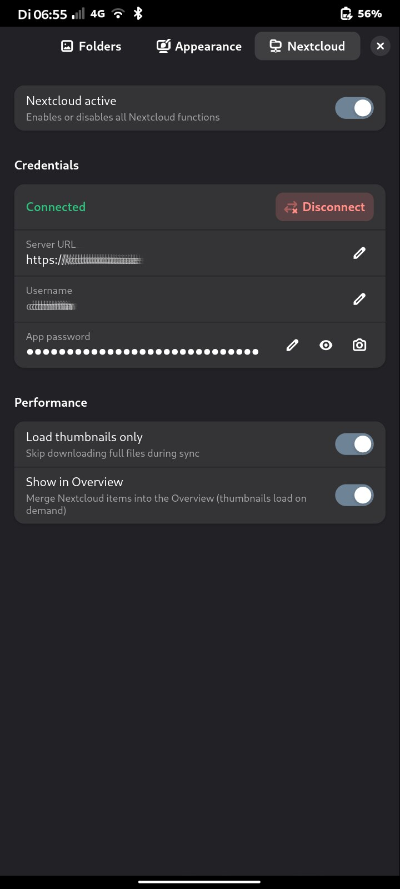

# Muga — Photo Gallery

A fast, clean photo and video gallery for Linux desktops and Linux phones (Phosh / FuriOS), built with GTK 4 and libadwaita.  
  
⚠️ **AI-assisted project**  
  


---

## What is Muga?

Muga is a gallery app that feels right at home on a modern GNOME desktop and adapts to Linux phones running Phosh (FuriOS, Droidian, UBports). It scans your media folders, ensures consistently smooth performance thanks to a thumbnail cache and an SQLite index, and stays out of your way while doing so. Shots taken with the phone's own camera app appear in the grid on their own, without a manual refresh. In addition to several editing features, it allows you to effortlessly integrate your Nextcloud Photos.

---

## Screenshots









---

## Highlights

- **Multiple libraries**  
separate tabs for Photos, Pictures, Videos, Screenshots, and any extra folders you add
- **New photos appear on their own**  
a shot from any camera app, a screenshot, a file manager copy or a sync client shows up in the grid without a manual refresh
- **Mobile-adaptive UI**  
narrow-window breakpoints hide / re-order desktop-only chrome on phones; pull-to-refresh replaces the title-bar refresh icon
- **Nextcloud sync**  
browse your Nextcloud photo library directly, no FUSE or GVFS mount needed; thumbnails load on demand
- **QR code scanner**  
scan Nextcloud app-password QR codes with the device camera to connect your account instantly
- **Date grouping**  
sort by date and photos are grouped under clear section headers (day / week / month / year). Two date sorts, because a photo has two dates: **Date (recorded)** uses the EXIF capture date, **Date (file)** the file's own timestamp — a shoot copied off a card today lands under the year it was taken, not under today. Long galleries use a sliding window: only the visible months stay in memory so jumping forward through years stays fast.
- **Built-in editor**  
crop, rotate, adjust brightness / contrast / colour channels, add frames for holidays and occasions, drop stickers
- **Video playback**  
watch videos directly in the app or hand them off to any external player
- **Selection mode**  
long-press any photo to enter multi-select, then delete or move a whole batch at once
- **Folder view**  
drill into subfolders; folder tiles show a 2×2 preview mosaic
- **MCP server**  
let an AI assistant search your library by date, camera or GPS — a built-in [MCP](https://modelcontextprotocol.io) endpoint over HTTP. Off by default, read-only unless you allow writes separately, needs a token you issue, and listens on this device only until you widen it

---

## Install & Run

**One-time install** — adds a launcher and a desktop entry, no root required:
```bash
bash install.sh
```
Then launch **Muga** from your app menu, or type `muga` in a terminal.

**Run directly without installing:**
```bash
python3 -m muga
```

**Uninstall:**
```bash
bash uninstall.sh
```

**Flatpak** — sandboxed, no Python dependencies on the host. Prebuilt and
signed for **x86_64** and **aarch64**:
```bash
flatpak remote-add --if-not-exists muga https://misc-de.github.io/Muga/de.cais.Muga.flatpakrepo
flatpak install muga de.cais.Muga
flatpak run de.cais.Muga
```
Updates from then on with `flatpak update`.

To build it yourself instead:
```bash
flatpak install -y flathub org.gnome.Platform//50 org.gnome.Sdk//50
flatpak-builder --user --install --force-clean build-dir de.cais.Muga.yml
flatpak run de.cais.Muga
```

Packaging the repository yourself — both architectures, signing, gh-pages —
is in the [Makefile](Makefile) (`make help`).

For the module layout, see [docs/architecture.md](docs/architecture.md); for
the GTK/libadwaita versions Muga targets, [docs/compatibility.md](docs/compatibility.md).

## Translating

Catalogues are standard gettext, in [po/](po/) — usable with Poedit, Weblate or
`msgmerge`. To add a language, copy `po/muga.pot` to `po/<code>.po` and
translate it; it is selectable in Settings as soon as the file exists.

Compiling is handled for you: `pip install .` builds the catalogues during the
install, and `install.sh` does the same. Running from a checkout needs no build
step at all — Muga reads `po/*.po` directly when no compiled catalogue is
present. `tools/i18n.py` carries its own MO writer, so none of this requires
gettext to be installed.

```bash
tools/i18n.py extract    # rebuild po/muga.pot from the sources
tools/i18n.py update     # merge the template into every po/*.po
tools/i18n.py compile    # build the .mo files an install ships
tools/i18n.py stat       # coverage per language
```

---

## Diagnostics

Open **Settings → Diagnostics** to copy a compact report for bug reports.
It includes runtime versions, storage paths, media-folder settings,
Nextcloud connection state, GStreamer camera plugins, and detected torch
sysfs paths. It does **not** include passwords or app tokens.

For camera debugging from a terminal, run:
```bash
MUGA_CAMERA_DEBUG=1 python3 -m muga
```

---

## Nextcloud Setup

1. Open **Settings → Nextcloud**
2. Enter your server URL and username
3. Either paste an app password or tap **Scan QR code** — go to *Nextcloud → Settings → Security → App passwords*, create one, and scan the QR code with your camera
4. Hit **Connect**

Photos are streamed directly over WebDAV. Thumbnails are cached locally; full files are only downloaded when you open them.

---

## MCP Server

Muga can expose its media index to an MCP client — an AI assistant, a script,
anything that speaks the protocol — so it can answer "which videos did I shoot
last August?" without you opening the app.

1. Open **Settings → MCP**
2. **Add token** and name it after the client that will use it, then copy the token
3. Pick under **Reachable from** how far it should listen — see below
4. Flip **MCP server** on — the address it is reachable at appears right below

The endpoint is Streamable HTTP at `http://<address>:8765/mcp`, authenticated
with `Authorization: Bearer <token>`. Point a client at it:

```json
{
  "mcpServers": {
    "muga": {
      "type": "http",
      "url": "http://127.0.0.1:8765/mcp",
      "headers": { "Authorization": "Bearer muga_…" }
    }
  }
}
```

Six read-only tools: `list_categories`, `list_media`, `search_media`,
`list_folders`, `get_media`, `gallery_stats`. Search covers filenames, camera
make and model, GPS coordinates, and dates — a year, a year-month, or a month
name in German or English. Dates mean the **capture date** from EXIF where the
file has one, so a photo shot in 2019 and copied over today is found under
2019, not under this year; files with no EXIF date fall back to their
modification time.

### Write access

Off by default, behind its own switch in *Settings → MCP* that asks for
confirmation before it turns on. Turning the server on, or widening how far it
listens, does not grant it.

With it on, three more tools appear: `add_media`, `move_media` and
`delete_media`. They are confined to your configured media folders — paths are
resolved before they are checked, so `../..` and symlinks pointing out of the
library are refused — and deletions go to the desktop trash rather than being
erased. While the switch is off the tools are not offered to a client at all,
and a client that names one anyway is turned away.

### Reachable from

The combo lists the addresses this machine actually has, so you pick a real
interface rather than a scope that may not exist here:

| Choice | Binds | Who can reach it |
|---|---|---|
| **This device only** (default) | `127.0.0.1` | Only clients running on this device |
| **Local network** | your LAN address, e.g. `192.168.0.24` | Anything on that network with a token |
| **Public address** | a globally routable address, if this machine has one | Anything that can route to it — see the warning below |
| **All interfaces** | `0.0.0.0` | Every network this machine is on |

A scope with no address behind it right now (no public IP, wifi down) is simply
not offered. If the one you saved disappears later, the server falls back to
loopback rather than to something wider.

Two things hold regardless of the scope: the server will not start until you
have issued a token, and deleting a token cuts that client off on its very next
request, with no restart. There is no TLS — on anything beyond
*This device only*, the metadata and the token travel in the clear, so keep it
to networks you trust and never forward the port from a router.

---

## Privacy & License

- **Privacy:** local-first, no telemetry. See [PRIVACY.md](PRIVACY.md) for what is stored where and how to wipe it.
- **License:** [MIT](LICENSE).
